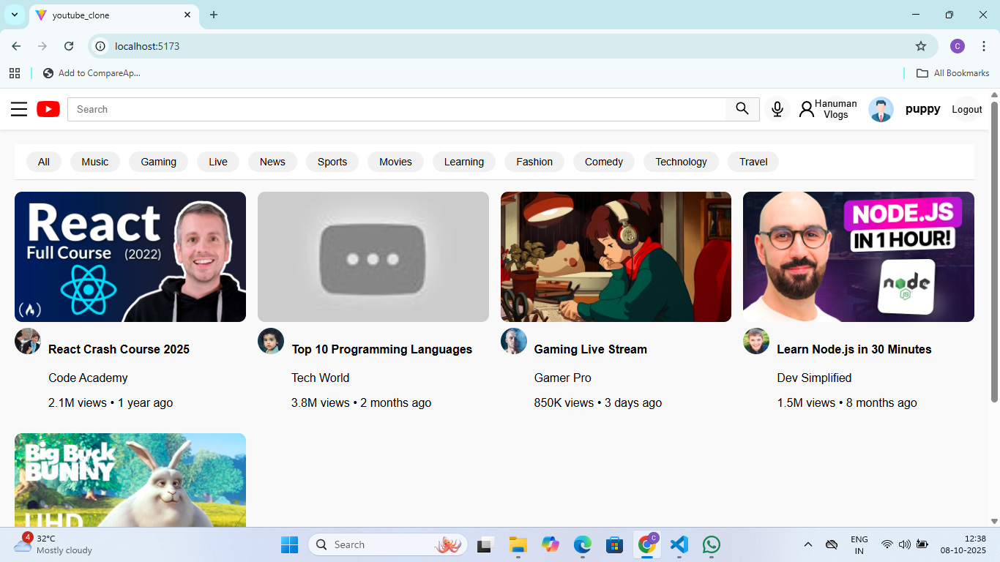
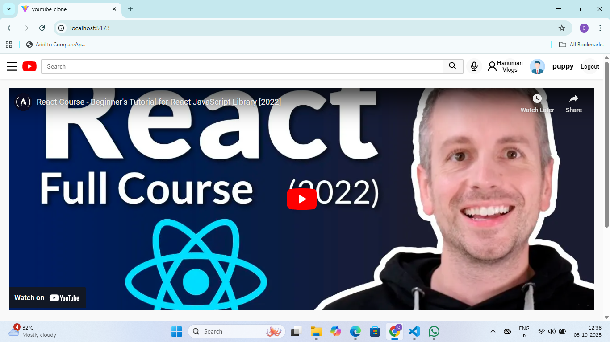
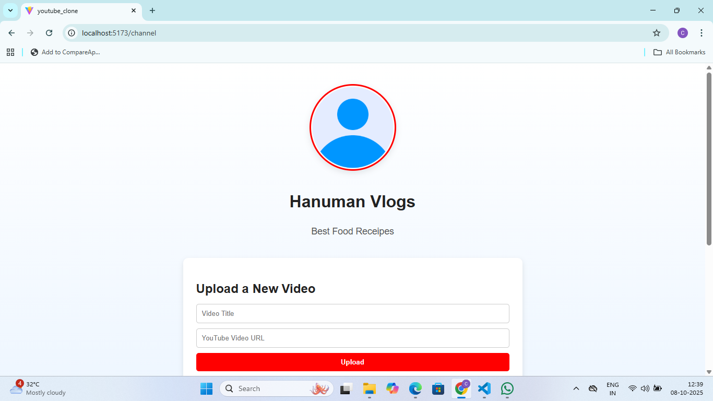

🎬 YouTube Clone Project

A full-stack YouTube clone built with MERN stack (MongoDB, Express, React, Node.js) and Vite for frontend bundling. Users can browse, search, and watch videos in a responsive, YouTube-like interface.

📌 Project Purpose

This project was created to:

Learn full-stack development with MERN + Vite.

Build a responsive video platform similar to YouTube.

Practice React components, routing, and state management.

Implement backend APIs with Express and MongoDB.

🗂 Project Structure
youtube_clone/
│
├─ frontend/               # React + Vite frontend
│  ├─ public/              # Static files (index.html, favicon)
│  ├─ src/
│  │  ├─ components/       # Reusable components (Header, Sidebar, VideoCard)
│  │  ├─ pages/            # Home, Channel, VideoPlayer pages
│  │  ├─ data/             # Sample video/channel data
│  │  └─ App.jsx
│  ├─ package.json
│  └─ node_modules/        # Ignored in git
│
├─ backend/                # Node.js + Express backend
│  ├─ controllers/         # API controllers
│  ├─ models/              # MongoDB models
│  ├─ routes/              # Express routes
│  ├─ server.js            # Main server file
│  ├─ package.json
│  └─ node_modules/        # Ignored in git
│
├─ .gitignore              # Ignore node_modules, build files, env files
└─ README.md

⚡ Features

Home page with video thumbnails and filtering.

Search functionality.

Video player page with video details.

Channel creation and display.

Fully responsive design for desktop, tablet, and mobile.

🛠 Setup Instructions
Prerequisites

Node.js & npm

MongoDB (local or Atlas)

Git

Backend Setup
cd backend
npm install

Create a .env file:
MONGO_URI=your_mongodb_connection_string
PORT=5000

Start the server:
npm run dev

Backend runs at: http://localhost:5000

Frontend Setup
cd frontend
npm install
npm run dev

Frontend runs at: http://localhost:5173

💻 Usage

Open the app in your browser.

Browse videos on the Home page.

Search for videos using the search bar.

Click a video to watch it on the Video Player page.

View or create channels via the Channel page.

📁 Files to Push to Git

frontend/src/, frontend/public/, frontend/package.json

backend/controllers/, backend/models/, backend/routes/, backend/server.js, backend/package.json

.gitignore and README.md

❌ Files to Ignore

node_modules/

.env

Build folders (dist/, build/)

Logs (*.log)

🖼 Screenshots

Home Page

Video Player Page

Channel Page
